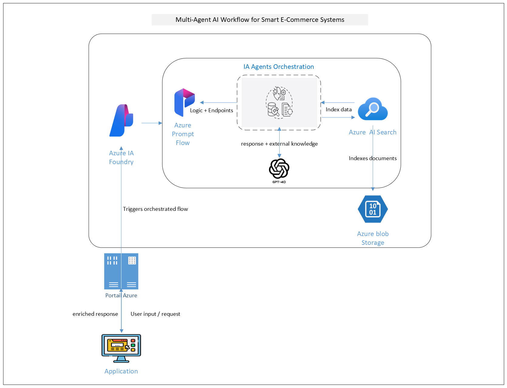
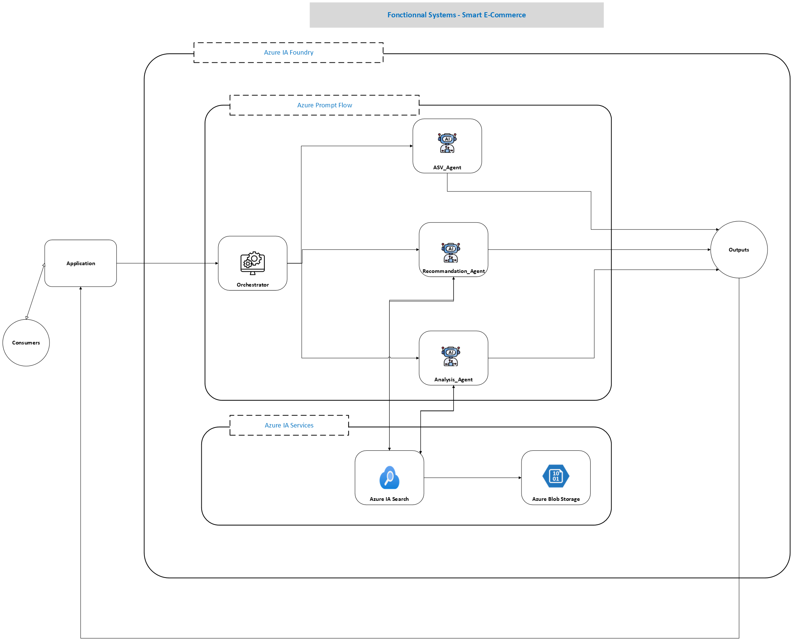
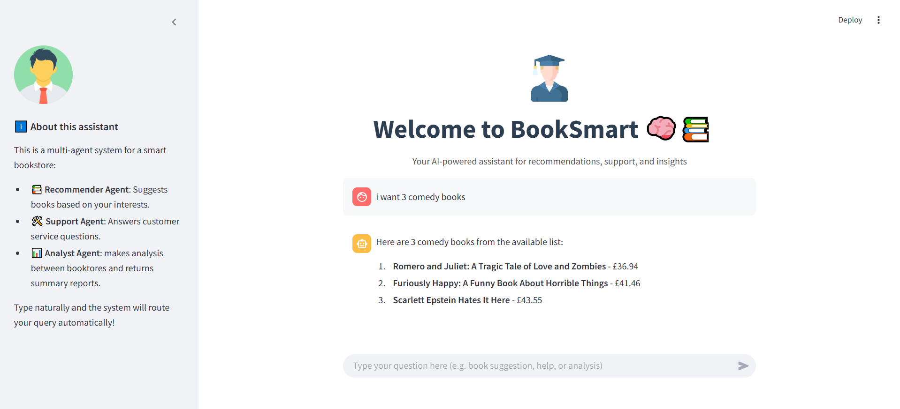
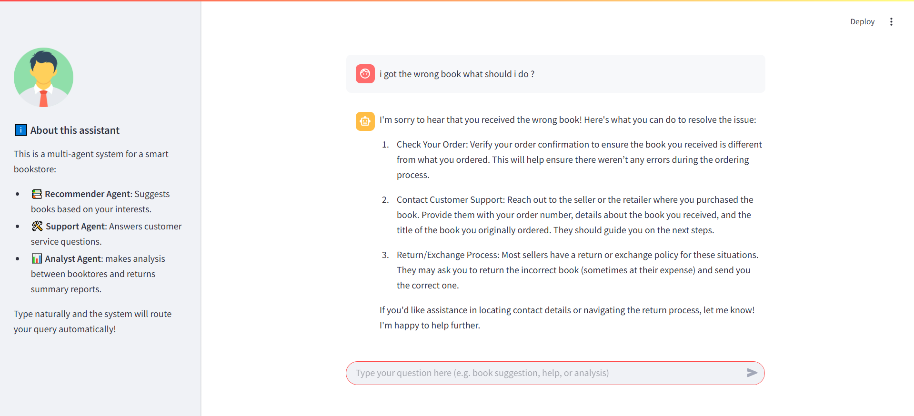

# 📚 AI-Powered Multi-Agent System for Online Bookstore

## 🚀 Overview

In the age of digital commerce, online bookstores face growing demands to deliver **personalized**, **efficient**, and **scalable** experiences. This project introduces an **AI-driven multi-agent system** designed to handle customer support, business analytics, and personalized book recommendations — all orchestrated through an intelligent, modular framework.

---

## ❓ Problem Statement

Traditional e-commerce systems often operate in silos:
- 💬 Customer service is slow and reactive,
- 📊 Analytics are manual and delayed,
- 📚 Recommendations are static or irrelevant.

These inefficiencies lead to poor customer engagement and higher operational costs.

**Challenge:**  
Design a smart, scalable architecture that can:
- Understand and resolve customer queries with context,
- Analyze structured internal and external data for insights,
- Recommend products in real-time,
- Coordinate these tasks seamlessly.

---

## 💡 Innovation: A Multi-Agent Solution

This project delivers a **modular, intelligent architecture** based on the **agentic framework**, centered around an **Orchestrator Agent** that delegates tasks dynamically and efficiently.

### 🧠 Orchestrator Agent
Acts as the system’s brain:
- Detects intent in user input,
- Delegates to one of the specialized agents:
  - **Customer Service Agent**
  - **Analytics Agent**
  - **Recommendation Agent**
- Reduces computational overhead by activating only one agent per request
- Enables energy-efficient, scalable operations

---

## 🧩 System Components

| Agent | Description |
|-------|-------------|
| 💬 **Customer Service Agent** | Handles support and complaint resolution with contextual understanding. |
| 📈 **Analytics Agent** | Provides business insights from internal and competitive data. |
| 📚 **Recommendation Agent** | Suggests books based on user preferences and queries. |
| 🌐 **Streamlit Interface** | A clean, interactive UI for seamless system interaction. |

---

## 🎯 Project Goals

- ✅ Build a modular, AI-driven agentic architecture  
- ✅ Deploy intelligent task delegation through an orchestrator  
- ✅ Automate customer support workflows  
- ✅ Generate actionable business insights  
- ✅ Deliver personalized recommendations using AI  

---

## 🔄 Data Ingestion & Indexing Pipeline

### 📥 Data Sources
- 🧪 **Fictional Bookstores**: We scraped product data from [books.toscrape.com](http://books.toscrape.com) and used it to build two **fictive bookstore datasets**:
  - **Vendor A**: Our platform's internal catalog.
  - **Vendor B**: Simulated competitor with overlapping categories and prices.

- The data is stored in CSV format with structured fields including title, category, price, availability, and rating.

### ☁️ Centralized Storage
- All CSV files are uploaded to **Azure Blob Storage** for secure and scalable storage.

### ⚙️ Indexing with Azure AI Foundry
- **No-code indexing** for structured CSVs  
- Accelerated setup and iteration  
- Supports RAG-based analytics and recommendations

---

## 🛠️ Technology Stack

| Tool | Purpose |
|------|---------|
| **Python** | Core language for system development |
| **Streamlit** | Frontend UI |
| **Azure AI Search** | RAG-based intelligent document retrieval |
| **GPT-4o** | Natural language reasoning and interaction |
| **Azure AI Foundry** | Agent deployment and execution |
| **Prompt Flow (Azure)** | Workflow orchestration and prompt optimization |

---

## 🧭 Architecture

### 📌 Diagram 1 – Multi-Agent AI Workflow for Smart E-Commerce Systems

This diagram represents the global orchestrated pipeline of the intelligent multi-agent system on **Azure**, tailored for smart e-commerce.

#### 🔧 Components:
- **Azure Prompt Flow**: Coordinates task delegation through logic-based flow execution.
- **IA Agents Orchestration**: Routes tasks to specialized agents to ensure relevance and resource optimization.
- **Azure Blob Storage**: Central storage for structured datasets from Vendor A and B.
- **Azure AI Search**: Indexes and retrieves documents to fuel AI responses.
- **GPT-4o**: Handles reasoning and natural language generation for agents.
- **Azure AI Foundry**: Deploys and monitors orchestrated flows.
- **Streamlit App**: User interface capturing input and displaying smart outputs.

---

### 📌 Diagram 2 – Functional System Architecture – Smart E-Commerce

This second diagram decomposes the system into functional building blocks and emphasizes how **agents**, **Azure services**, and **users** interact.

#### 🧠 Multi-Agent System Breakdown:
- **Orchestrator Agent**: Analyzes input intent and dispatches the request to the correct specialized agent.
- **SAV_Agent**: Manages customer support, complaints, and post-sale guidance.
- **Recommendation_Agent**: Delivers personalized product recommendations.
- **Analysis_Agent**: Compares internal and external datasets to generate reports.

#### 🔌 Azure Integration:
- **Azure AI Services**: Provides GPT-4o and embeddings for intelligent processing.
- **Azure Blob Storage**: Acts as the system’s data lake.
- **Azure AI Search**: Enables fast, semantic search across indexed documents.
- **Azure AI Foundry**: Ensures scalable deployment and lifecycle management of the intelligent system.

---

### 🔄 Prompt Flow Logic Graph

This is the real execution graph from **Azure Prompt Flow**, representing the internal logic and flow of our multi-agent system.

#### 🔍 Key Observations:
- The **inputs** are processed by the **Orchestrator**, which then dynamically decides which agent (recommendation, analytics, or support) should be activated.
- Flows like `recommendation_context`, `competition_context`, and `property_products_state` provide structured data used by each agent.
- **Bypassed flows** (in gray) indicate unused branches based on query intent — showcasing Prompt Flow’s conditional logic capability.
- **Only the necessary agent is triggered** at runtime, optimizing performance and cost.

This visual logic proves that Prompt Flow was not just used for chaining — it served as our **control layer**, enabling real-time decision making with zero manual API routing.

---

## 🔍 Retrieval-Augmented Generation (RAG)

This system adopts the **RAG paradigm** to ensure factual, real-time answers:
- Instead of relying solely on GPT-4o's pretrained knowledge, the system **first retrieves** relevant documents from **Azure AI Search**.
- These documents are retrieved from **indexed CSV data** stored in **Azure Blob Storage**, reflecting Vendor A and B offerings.
- GPT-4o then **generates a grounded response** based on this retrieved content — increasing **accuracy, trust, and explainability**.

Benefits of this approach:
- ✅ Reduces hallucinations  
- ✅ Incorporates live, domain-specific context  
- ✅ Enhances user trust through transparent reasoning

---

## 🖼️ Screenshot 1: Book Recommendation (Recommender Agent)

**Highlights:**
- The user requests **"3 comedy books"**.
- The **Recommendation Agent** returns contextual book suggestions, complete with titles and prices.
- The side panel explains the role of each agent for clarity.
- The interface is clean and friendly, encouraging natural interaction.

---

## 🖼️ Screenshot 2: Customer Support Query (Support Agent)

**Highlights:**
- The user reports: **"I got the wrong book what should I do?"**
- The **Customer Service Agent** provides a clear 3-step process:
  1. Order verification,
  2. Contacting support,
  3. Return/exchange policy.
- The system responds in a supportive, human-like tone with actionable advice.

---

## 📌 Conclusion

This multi-agent system reimagines how online bookstores operate by combining customer service, competitive analytics, and smart recommendations into one AI-powered experience.  
By integrating cutting-edge Azure services, GPT-4o, and Prompt Flow orchestration with a well-designed agentic framework, it delivers a scalable, modular, and intelligent e-commerce foundation ready for real-world use.
